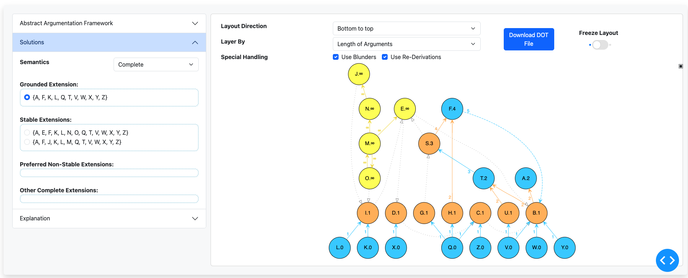

<div align="center">
    
    <h1 align="center">AF-XRAY</h1>
    <h3> Argumentation Framework eXplanation, Reasoning, and AnalYsis  </h3>
</div>

<!-- [](https://github.com/idaks/xray/actions/workflows/deploy.yml) -->




# Overview

AF-XRAY is a tool designed to explain abstract argumentation frameworks using provenance tracking, visualization techniques, and logic programming. For example, it can help users understand how stable extensions are derived based on the following logical rule:

$$
\text{Defeated}(x) \leftarrow \text{Attacks}(y, x), \neg \text{Defeated}(y).
$$

# Usage 

## Website
You can access the tool by visiting the following website ([go.illinois.edu/xray](https://go.illinois.edu/xray)) directly.


## Locally Development
> [!TIP]
> It is recommended to use a Conda environment.

Install the necessary package

```bash
git clone https://github.com/idaks/xray
conda create -n xray python=3.10
conda activate xray
conda install anaconda::graphviz
cd xray
pip install -r requirements.txt
python app.py
```
<!-- before deployment, you can test by running
```bash
gunicorn app:server
``` -->

## Docker Manually Deployment
Rebuild the Docker Image
```bash
docker buildx build --platform linux/amd64 -t seanyl/xray:app .
```

Push the image to docker hub
```
docker push seanyl/xray:app
```

# License
The software is available under the MIT license.


# Acknowledgment
AF-XRAY is built upon [PyArg](https://github.com/DaphneOdekerken/PyArg)

# Contact
For any queries, please open an issue on GitHub or contact [Yilin Xia](https://yilinxia.com/)